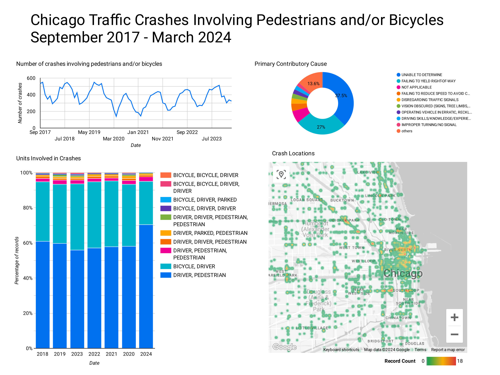
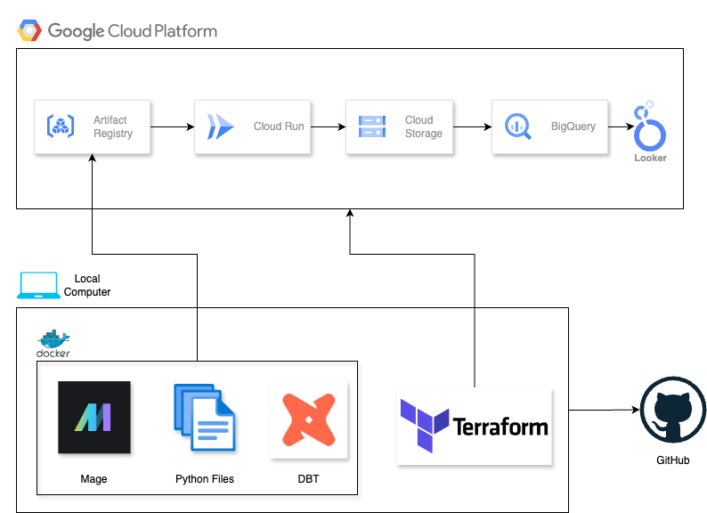
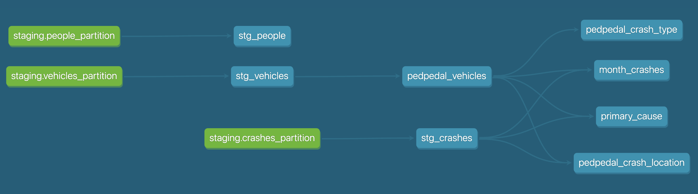

# Chicago Traffic Crashes 

The following project was built as a final project for [DataTalks.Club's Data Engineering Zoomcamp](https://github.com/DataTalksClub/data-engineering-zoomcamp).

- [Problem Description](#problem-description)
- [Dataset](#dataset)
- [Dashboard](#dashboard)
- [Findings](#findings)
- [Technologies](#technologies)
- [Design Diagram](#design-diagram)
- [DBT Lineage Graph](#dbt-lineage-graph)
- [Reproducibility](#reproducibility)
- [Disclaimer](#disclaimer)

## Problem Description

This project sets out to answer the following questions:
- How often do traffic crashes involving pedestrians and/or bicycles occur in Chicago?
- Where within the city do these traffic crashes occur?
- What type of traffic crash occurs more frequently, those involving pedestrians or those involving bicycles?
- What are the causes of these traffic crashes?


## Dataset
Data used for this project comes from the [Chicago Data Portal](https://data.cityofchicago.org/). The data used are the [Traffic Crashes - Crashes](https://data.cityofchicago.org/Transportation/Traffic-Crashes-Crashes/85ca-t3if/about_data), [Traffic Crashes - Vehicles](https://data.cityofchicago.org/Transportation/Traffic-Crashes-Vehicles/68nd-jvt3/about_data), and [Traffic Crashes - People](https://data.cityofchicago.org/Transportation/Traffic-Crashes-People/u6pd-qa9d/about_data) datasets.

The data used includes traffic crashes occuring within the City of Chicago and under the Chicago Polic Department jurisdiction. This project dashboard looks at data starting from September 2017, the date when citywide data became available.


## Dashboard
Explore the dashboard [here](https://lookerstudio.google.com/s/gQfRPryZ_0s).




## Findings
- Traffic crashes involving pedestrians and/or bicycles occur in a cyclical fashion, with crashes most often reported around the summer months of August and September. Months with the fewest reported crashes are typically January and February.
- Reported crashes often occur in the Loop and River North areas, and along stretches of N Milwaukee Ave.
- A majority of reported traffic crashes involve two units. Of these crashes, those involving a driver and a pedestrian occur more often than those involving a driver and a bicycle.
- The primary contributory cause of these crases is often unable to be determined. In cases where a primary cause is listed in the report, it is a failure to yield right-of-way.


## Technologies
- **Docker** - To run Mage in a containerized environment
- **Terraform** - To manage GCP infrastructure
- **Google Cloud Storage** - To serve as our data lake
- **Google BigQuery** - To serve as our data warehouse
- **Mage** - To orchestrate our pipelines
- **DBT Core** - To transform our warehouse data for analysis
- **Google Looker Studio** - To design a dashboard for data visualization


## Design Diagram


## DBT Lineage Graph


## Reproducibility

### Prerequisites
- Terraform
- Docker
- gcloud CLI
- Google Cloud Project

### Steps
1. Clone this repository by running:
    ```
    git clone https://github.com/juruchi/chicago-traffic-crashes.git chicago-traffic-crashes \
    && cd chicago-traffic-crashes \
    && cp dev.env .env && rm dev.env 
    ```
    This clones the chicago-traffic-crashes repository, and copies the ```dev.env``` to ```.env```, which is ignored by git.

2. Set your Google Cloud Project ID as the ```TF_VAR_project_id``` variable in your ```.env``` file. Both Terraform and Mage files will use this environment variable.

3. Create a service account with the necessary permissions. 
    - Artifact Registry Reader
    - Artifact Registry Writer
    - BigQuery Admin
    - Cloud Run Admin
    - Cloud SQL Admin
    - Service Account Token Creator
    - Storage Admin

4. Save your service account as a secret in Google Secret Manager. Specific instructions for doing this can be found in steps 1-5 [here](https://docs.mage.ai/production/deploying-to-cloud/secrets/GCP#creating-secrets).

5. After saving your secret to Google Secret Manager, follow steps 1-5 [here](https://docs.mage.ai/production/deploying-to-cloud/gcp/setup#method-a-terraform-configurations). This will allow Google Cloud Run (to be built using Terraform) to access the secret.

6. Create a custom Docker image and push it to GCP Artifact Registry. This is the Docker image that will be used for running Mage in the cloud. 
    1. Create a Docker image with the Mage and DBT project files. CD to the root project folder. Build a custom Docker image using the following command, ```docker build --platform linux/amd64 --tag traffic:latest .```.
    2. Create a repository on GCP Artifact Registry by following steps 1-3 [here](https://docs.mage.ai/production/deploying-to-cloud/gcp/gcp-artifact-registry). Name your repository ```traffic-crashes``` and set your location as ```us-central1```.
    2. Tag and push the Docker image to Google Artifact Registry. Run ```docker tag traffic:latest us-central1-docker.pkg.dev/[project_id]/traffic-crashes/traffic:latest```, replacing [project_id] with your Google Cloud Project ID. Then run ```docker push us-central1-docker.pkg.dev/[project_id]/traffic-crashes/traffic:latest```, replacing [project_id] with your Google Cloud Project ID.

7. Log into GCP from CLI by running ```gcloud init``` followed by ```gcloud auth application-default login```.

8. Create a Google Storage Bucket and Bigquery Dataset within your Google Cloud Project. To do this, open a terminal window and CD into the ```terraform_gcp_database``` folder. Activtate your ```.env``` file by running ```source ../.env```. Then run ```terraform init``` followed by ```terraform apply```.

9. Create the necessary infrastructure to run the Mage Docker image in the cloud. To do this, CD into the ```terraform_gcp_mage``` folder. Run ```terraform init``` followed by ```terraform apply```.
    - Once the infrastructure is ready, you will receive an IP address as part of the output in your terminal. Go to http://[IP_address] to access Mage.

10. Run the ```api_to_gcs``` pipeline. This will extract the data from the Chicago Data Portal and load it to your Google storage bucket as partitioned parquet files. Once the pipeline is complete, it will trigger the next pipeline, ```gcs_to_bigquery```. This pipeline will take the data from the storage bucket and load it to BigQuery. After the pipeline is done running, the ```dbt_transformations``` pipeline will be triggered. This pipeline will start a series of SQL models to create the tables necessary for the dashboard. The dashboard is built using the ```month_crash```, ```pedpedal_crash_location```, ```pedpedal_crash_type```, and ```primary_cause``` SQl models.


## Disclaimer
This site provides applications using data that has been modified for use from its original source, www.cityofchicago.org, the official website of the City of Chicago.  The City of Chicago makes no claims as to the content, accuracy, timeliness, or completeness of any of the data provided at this site.  The data provided at this site is subject to change at any time.  It is understood that the data provided at this site is being used at one’s own risk.